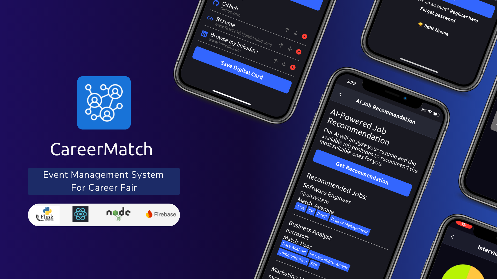

<p align="center">
 
  </a>
</p>

<h3 align="center">CareerMatch</h3>
<p align="center">
  Enhancing connections between students and employers.
  <br>
  <a href="https://wenxuanlee.medium.com/i-built-a-mobile-app-to-help-students-find-internships-at-career-fairs-02930d7c67fa"><strong>Read Article »</strong></a>
  <br>
  <br>
  ·
  <a href="https://rapi-ui.kikiding.space/">Themes</a>
  ·
  <a href="https://wenxuanlee.medium.com/">Blog</a>
  ·
  <a href="#features">Features</a>
  ·
  <a href="#future-improvements">Future Improvement</a>
</p>
<p align="center">
  
  &nbsp;&nbsp;&nbsp;&nbsp;
  
  &nbsp;&nbsp;&nbsp;&nbsp;
  
  &nbsp;&nbsp;&nbsp;&nbsp;
  
</p>

## Project Description

CareerMatch is a mobile application designed to streamline the career fair process for universities. This innovative system serves three main user types: students, employers, and administrators.

The primary goals of this project are to address key issues in traditional career fair management:

1. Inefficient event and company selection processes
2. Limited digital networking and information exchange capabilities

## Features

- User Authentication and Registration with role-based access (student, employer, admin)
- Event Creation and Management
- QR Code Generation and Scanning feature
- Digital Card Identity for efficient information exchange
- AI Resume Builder and Smart Resume Screening
- Cloud Documentation for company brochures and online resume submission
- Questionnaire System for event feedback
- CSV Exportation for event questionnaires and submitted resumes
- Interview System (CRM-like) for application tracking and scheduling

## Requirements

- Node.js
- Python 3.8+
- Expo CLI
- A Firebase account

## Installation Guide

### Frontend Setup

1. Ensure you have Node.js installed on your system.

2. Install Expo CLI globally:

   ```bash
   npm install -g expo-cli
   ```

3. Clone the repository:

   ```bash
   git clone https://github.com/wenxuangithub/CareerMatch.git
   ```

4. Navigate to the project directory:

   ```bash
   cd careermatch
   ```

5. Install dependencies:

   ```bash
   npm install
   ```

6. Set up Firebase:
   - Create a new Firebase project
   - Add a web app to your Firebase project
   - Copy the Firebase configuration
   - Create a `.env` file in the root directory and add your Firebase config

### Backend Setup

1. Ensure you have Python 3.8+ installed on your system.

2. Create a virtual environment:

   ```bash
   python -m venv venv
   ```

3. Activate the virtual environment:

   - On Windows:
     ```bash
     venv\Scripts\activate
     ```
   - On macOS and Linux:
     ```bash
     source venv/bin/activate
     ```

4. Install requirements:
   ```bash
   pip install -r requirements.txt
   ```

## Running the Application

1. Start the Flask backend:

   ```bash
   python app.py
   ```

2. In a new terminal, start the Expo development server:
   ```bash
   expo start
   ```

## Possible Issues

### Local Network Connectivity

If you're facing issues with 127.0.0.1 for external iOS/Android local connectivity, try one of these solutions:

1. Set the React Native Packager hostname:

   ```
   $Env:REACT_NATIVE_PACKAGER_HOSTNAME="Your IP address"
   ```

2. Use your own laptop's hotspot to connect your phone.

3. If neither method works, use an ngrok tunnel by adding `--tunnel` when launching Expo:
   ```
   expo start --tunnel
   ```

### Virtual Environment Issues

If you're unable to launch the virtual environment due to network firewall issues, follow these steps:

1. Open Command Prompt
2. Execute the following command:
   ```
   set-executionpolicy remotesigned
   ```
   Alternatively, use your preferred method to adjust execution policies.

## Future Improvements

Continuous updating to match with future technology are essentials. Therefore I am committed to continually enhancing CareerMatch.

Here are some areas I am exploring for future development:

1. Scalability

   - Implement load balancing to handle increased user traffic
   - Optimize database queries for faster response times
   - Consider microservices architecture for improved modularity and scalability

2. Enhanced Security

   - Implement better encryption methods for sensitive data
   - Introduce two-factor authentication for user accounts

3. Advanced AI Features

   - Improve resume screening algorithms with machine learning
   - Implement AI-driven matchmaking between students and employers

4. Cross-platform Compatibility

   - Extend support to web browsers for broader accessibility

5. Integration Capabilities

   - Develop APIs for integration with university management systems
   - Enable synchronization with popular calendar applications

6. Enhanced Analytics

   - Implement advanced analytics dashboard for event organizers
   - Provide personalized insights for students and employers

7. Offline Functionality
   - Implement offline mode for basic app functionality without internet connection
   - Ensure data synchronization when connection is restored
